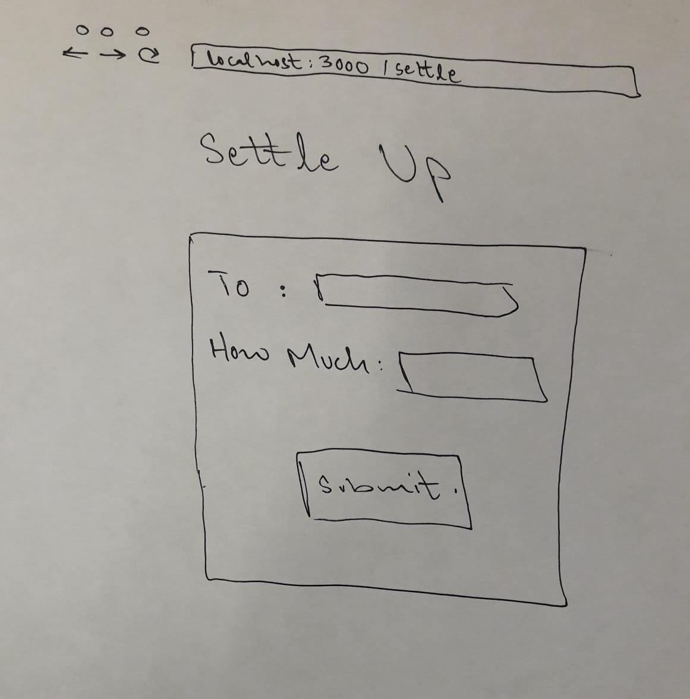

# SplitIt

## Overview

Splitting food and grocery bills get complicated when you're in college and hanging out with the same group of friends. Its a hassle to keep a track of who owes whom and how much, specially when the number of bills starts increasing. And that is why we have SplitIt!

SplitIt is a web app that records all your bills and allows you to keep a track of shared expenses so that you get paid the right amount! Users can register and log in. Once they're logged in, they can create, view and get a summary of all expenses. They can also settle up expenses and remind friends about pending payments.

## Data Model
The application will store Users and Expenses. Users can have multiple Expenses (via references).

An example user:

This will contain the username, password, email, full name and all the expenses saved by the user.

```javascript
{
  username: "alishazal",
  hash: "74cca9cb59250c50cfb4ff39e7540621"
  name: "Ali Shazal"
  email: "as10505@nyu.edu"
  expenses: // an array of references to Expense documents
}
```

An example expense:

This will have a reference to the user who created the expense, its description, total amount in dollars, if the user paid for it, how many people it was split between, among whom it was split and at what date/time it was created.

```javascript
{
  user: // a reference to a User object
  description: "Chipotle on Nov 7, 2018",
  totalAmount: 13.75,
  iPaid: true,
  splitWays: 3,
  splitBetween: ["Joe", "Sam"]
  createdAt: // timestamp
}
```

## [Link to Commented First Draft Schema](db.js) 

## Wireframes

(___TODO__: wireframes for all of the pages on your site; they can be as simple as photos of drawings or you can use a tool like Balsamiq, Omnigraffle, etc._)

/ - Page for login/register


/home - Page for showing all expenses associated to an account


/home/add - Page for adding an expense using a form


/home/balance - Page for showing balance between each friend


/home/settle




## Site map


## User Stories or Use Cases

1. As non-registered user, I can only register a new account with the site.
2. As a registered user, I can log in to the site
3. As an authenticated user, I can:
    * create a new expense
    * edit existing expenses.
    * delete existing expenses.
    * view all of the expenses I've created in a single list
    * view a summary of balances
    * settle up
    * log out

## Research Topics

* (6 points) Angular
    * I want to learn and explore Angular, so I'm using that as my front-end library.
    * In class we've learned everything in the MEAN stack except Angular, so learning it will make me a MEAN stack developer.
    * It's widely and is very powerful.
    * Since it's very challenging to learn, I've assigned it 5 points.

* (3 points) User authentication using PassportJS
    * Only authenticated users will be able to use my app.
    * I will use PassportJS for this.
    * Passport is very simple and easy to use, which is great since I only have 3 weeks for my project.
    * It can easily be integrated with Express. 
    * I'll also have the option to intergrate 3rd party authentication (via Facebook, Google, etc).

**8 points total out of 8 required points** 


## [Link to Initial Main Project File](app.js) 

## Annotations / References Used
None as of Milestone 1.
